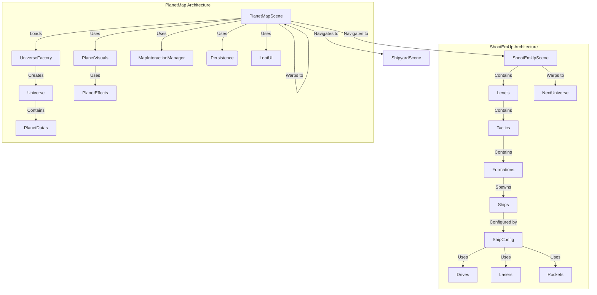

# Laser Phaser <a href="https://pkcpkc.github.io/laser-phaser/"></a> <a href="./LICENSE"></a>


## Credits
Concept and design by **Leopold** and **Thaddeus**.  
Implemented with the help of [**Google Antigravity**](https://antigravity.google/), [**Phaser.io**](https://phaser.io/) and... **Paul** ;)

## Homage
This game is a homage to the legendary late 80s shooter games that defined the genre. We draw inspiration from the classics:

*   **R-Type**
*   **Xenon II Megablast**
*   **Blood Money**
*   **Katakis**

### Gallery

| Game | Cover | Gameplay |
| :--- | :---: | :---: |
| [**R-Type**](https://en.wikipedia.org/wiki/R-Type) |  |  |
| [**Xenon II Megablast**](https://en.wikipedia.org/wiki/Xenon_2:_Megablast) |  |  |
| [**Blood Money**](https://en.wikipedia.org/wiki/Blood_Money_(video_game)) |  |  |
| [**Katakis**](https://en.wikipedia.org/wiki/Katakis) |  |  |

## Markers Setup

Markers are special pixels defined directly in the ship's source image (`res/ships/*.png`) to define attachment points for components. They are stripped during atlas generation but used to generate metadata.

### Marker Types

| Type | Color (Hex) | RGB | Description |
| :--- | :--- | :--- | :--- |
| **Thruster** | `#FFA500` | `255, 165, 0` | Positioning for engine trails. |
| **Laser** | `#00FF00` | `0, 255, 0` | Attachment point for laser cannons. |
| **Rocket** | `#FFFFFF` | `255, 255, 255` | Attachment point for rocket launchers. |
| **Armor** | `#000000` | `0, 0, 0` | (Future Use) Armor plate attachment. |

### Setting Orientation

To define the rotation (angle) of a marker (e.g., a side-firing cannon), place a **Red Pixel** (`#FF0000` / `255, 0, 0`) adjacent to the marker pixel within a 3x3 grid.

*   The generator looks at the 8 neighbors of the marker pixel.
*   If a red pixel is found, the angle is calculated from the vector `(Marker -> Red Pixel)`.
*   **Example**: Placing a red pixel directly to the **right** of a Green (Laser) pixel will set that laser's angle to 0° (firing right). Placing it **below** sets it to 90° (firing down).

## Features

### Universes

The game features multiple interconnected universes, each with unique planets, backgrounds, and challenges:

*   **Demo Universe**: The starting universe featuring diverse planet types and training missions.
*   **Blood Hunters Universe**: An advanced universe unlocked through universe warping, featuring unique aesthetics and challenging gameplay.

Universes can be switched via URL query parameter (`?universeId=blood-hunters`) for debugging or accessed through in-game progression and warp mechanics.

### Game Modes

*   **Shoot 'Em Up**: Classic side-scrolling shooter gameplay inspired by 80s arcade classics. Features wave-based combat, multiple weapon types, and dynamic enemy formations.
*   **Planet Map**: Navigate between planets in a living universe with orbital mechanics, unlockable locations, and visual effects.
*   **Shipyard**: (In Development) Trade and customize your ship with different configurations and components.
*   **Tower Defense**: (In Development) Defend strategic locations across the galaxy.

### Controls

The game supports two control schemes for navigating your ship:

#### Click/Tap Navigation (Primary)
Click or tap anywhere on the screen to set a target destination. Your ship will:
*   Smoothly accelerate toward the target point at 3× base speed.
*   Rotate to face the direction of travel.
*   Decelerate and return to upright orientation as it approaches the destination.
*   A green pulse effect marks the target location.

#### Keyboard Navigation (Alternative)
Use the arrow keys for direct thrust control:
*   **↑ / ↓**: Thrust forward / backward.
*   **← / →**: Thrust left / right.
*   **Space**: Fire weapons (also triggers auto-fire).

Keyboard input cancels any active click/tap target. The ship has automatic weapons fire enabled by default.

### Loot & Progression

The game features a persistent loot system tracking:

*   **Silver**: Basic currency for purchases and upgrades.
*   **Gold**: Premium currency for rare items.
*   **Gems**: Special resources for unique enhancements.
*   **Modules**: Collectible ship components (drives, lasers, rockets).

All progress is saved locally using `GameStatus` and persists across sessions.

### Planet Visual Effects

Planets come alive with a rich variety of visual effects:

*   **Satellite Effect**: Orbiting satellites around planets.
*   **Ghost Shade Effect**: Ethereal atmospheric shadows.
*   **Mini Moon Effect**: Small orbital companions.
*   **Glimmering Snow Effect**: Particle-based ice and snow effects.
*   **Hurricane Effect**: Dynamic storm systems with particle emitters.
*   **Spikes Effect**: Defensive or decorative surface protrusions.
*   **Gas Ring Effect**: Saturn-like gaseous ring systems.
*   **Solid Ring Effect**: Rocky or ice-based planetary rings.

Planets can be hidden and revealed through gameplay progression, creating a sense of discovery.

## Technical Overview

**Laser Phaser** is a modern web-based shoot 'em up built with robust technologies to ensure high performance and a smooth development experience.

*   **Engine**: [Phaser 3](https://phaser.io/) - A fast, free, and fun open-source HTML5 game framework.
*   **Language**: [TypeScript](https://www.typescriptlang.org/) - For type-safe, maintainable code.
*   **Build Tool**: [Vite](https://vitejs.dev/) - Next Generation Frontend Tooling for lightning-fast development servers and optimized builds.
*   **Testing**: [Vitest](https://vitest.dev/) - Blazing fast unit test framework. (Current Coverage: 100% of source files)

## Asset Pipeline

We use a custom asset pipeline to optimize game performance and development workflow:

*   **Texture Atlases**: Automatically generated from `public/assets` folders using `free-tex-packer-core`. Run `npm run build:atlases` to regenerate.
*   **Marker Generation**: Ship attachment points (markers) are defined in JSON/Typescript and validated. Run `npm run build:markers` to update.

### Game Entities & Architecture



### Key Components

*   **Universe System**: A modular architecture where each universe (Demo Universe, Blood Hunters Universe) is a self-contained configuration defining its own planets, backgrounds, and progression. Universes can be switched via URL query parameters (`?universeId=blood-hunters-level`) or through in-game warp mechanics.
*   **GameStatus**: Persistent game state manager that tracks global loot (silver, gold, gems, modules), unlocked planets, and player progress across sessions using localStorage.
*   **LootUI**: Reusable UI component for displaying and managing the player's collected loot across different scenes.
*   **Planet Effects**: A rich visual system with multiple effect types including satellites, ghost shades, mini moons, glimmering snow, hurricanes, spikes, and ring effects (gas/solid).
*   **Module System**: Ships are equipped with modular components organized into three categories:
    *   **Drives**: Engine systems providing propulsion effects (IonDrive, RedThrusterDrive, DustDrive).
    *   **Lasers**: Energy weapons with various colors and damage types (RedLaser, GreenLaser, WhiteLaser, BigRedLaser).
    *   **Rockets**: Projectile weapons with homing or explosive capabilities (GreenRocket, BloodRocket).
*   **Tactic System**: Enemy behavior is controlled by tactics (SinusTactic, LineTactic) that manage formations and coordinate ship movement patterns for dynamic combat encounters.

### Directory Structure

The project follows a domain-driven structure for scenes and content:

*   `src/scenes/`: Scene logic (Planet Map, Base Scene, etc.)
    *   `planet-map/`: Visuals and logic for the navigation map.
    *   `shoot-em-ups/`: Active gameplay levels and formations.
    *   `shipyards/`: Meta-game interfaces.
*   `src/ships/`: Ship definitions, configurations, and module logic.
    *   `modules/drives/`: Engine drive systems with visual effects.
    *   `modules/lasers/`: Laser weapon implementations and projectiles.
    *   `modules/rockets/`: Rocket weapon systems.
    *   `definitions/`: Ship type definitions (BloodHunter, BloodFighter, BloodBomber, BigCruiser, GreenRocketCarrier, Asteroids).
    *   `configurations/`: Pre-built ship loadouts with modules.
*   `src/logic/`: Core game managers (Collision, Game State, Player Control).

### Getting Started

To fire up the engines and start developing:

1.  **Install dependencies:**
    ```bash
    npm install
    ```

2.  **Generate Assets (Atlases & Markers):**
    ```bash
    npm run build:atlases
    npm run build:markers
    ```

3.  **Start the development server:**
    ```bash
    npm run dev
    ```

4.  **Start with debug mode (shows physics bodies):**
    ```bash
    npm run debug
    ```
    *Press the **B** key during gameplay to pause the game and dump the current game state to `console.log`.*

5.  **Build for production:**
    ```bash
    npm run build
    ```

6.  **Run tests:**
    ```bash
    npm test
    ```
