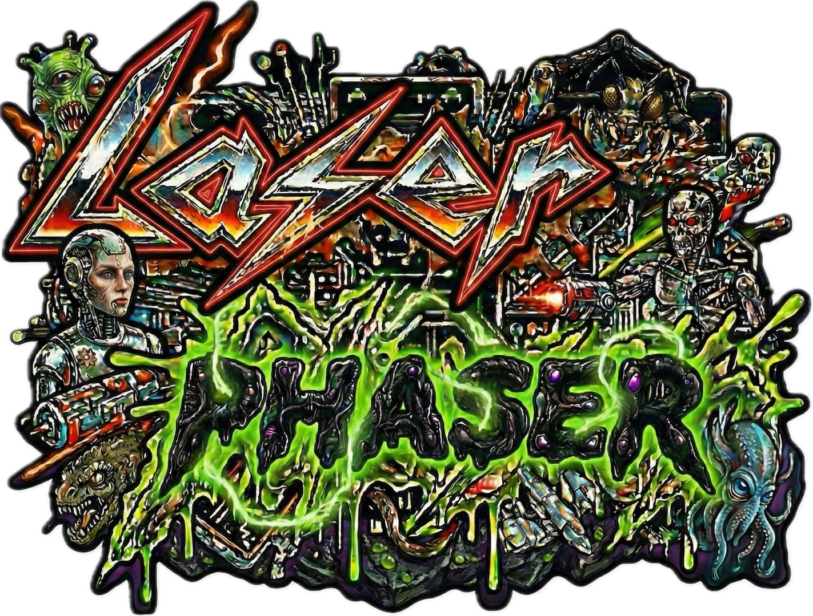

# Laser Phaser 

## 🚀 The Vision

**Laser Phaser** is born from the wild imaginations of **Leopold** and **Thaddeus**—two young Star Wars fans who spent their days drawing epic spaceships and dreaming of galactic battles. 

What started as sketches on paper has been brought to life through the incredible power of **Agentic Coding**. Using [**Google Antigravity**](https://antigravity.google/) and [**Phaser.io**](https://phaser.io/), we've turned those childhood dreams into a high-octane reality. (With a little help from **Paul** to keep the engines running! 😉)

## 🕹️ A Love Letter to the 80s

If you grew up with the pulse-pounding action of 80s arcade shooters, you'll feel right at home. **Laser Phaser** is a deep homage to the legends that defined a generation:

*   **R-Type** - For its iconic level design and massive bosses.
*   **Xenon II Megablast** - For that gritty, metallic vibe and "Bomb the Bass" energy.
*   **Blood Money** - For the relentless challenge and atmosphere.
*   **Katakis** - For the pure joy of side-scrolling mastery.

### THE LEGENDS

| Game | Cover | Gameplay |
| :--- | :---: | :---: |
| [**R-Type**](https://en.wikipedia.org/wiki/R-Type) |  |  |
| [**Xenon II Megablast**](https://en.wikipedia.org/wiki/Xenon_2:_Megablast) |  |  |
| [**Blood Money**](https://en.wikipedia.org/wiki/Blood_Money_(video_game)) |  |  |
| [**Katakis**](https://en.wikipedia.org/wiki/Katakis) |  |  |

## 🌟 Epic Features

### 🌌 Explore Vast Galaxies
Journey through multiple interconnected galaxies, from the beginner-friendly **Demo Galaxy** to the perilous **Blood Hunters Galaxy**. Each system is packed with unique planets, each with its own gravity, challenges, and secrets to uncover.

### 🎭 Immersive Storytelling
Experience the lore of the universe through dramatic **Planet Intros**. Watch as typewriter text reveals mission briefings over cinematic views of the planets you're about to conquer.

### 💥 Intense Arcade Combat
Engage in wave-based combat with a robust damage system. Watch enemy ships explode into debris as you tear through formations with your custom-built ship.

### 🛠️ Deep Customization (Shipyard)
*(In Development)* Visit the Shipyard to trade and customize your vessel. Choose from different **Drives** for speed, **Lasers** for precision, or **Rockets** for pure explosive power.

### 🎨 Stunning Visual Effects
The universe comes alive with orbital satellites, atmospheric ghost shades, hurricane storms, and majestic rings (both gaseous and solid). Every planet is a visual masterpiece!

## 🎮 Take the Helm

### How to Play
*   **Mouse/Touch**: Click anywhere to fly there. Your ship will accelerate and bank towards your target!
*   **Keyboard**: Use **Arrows** to fly and **Space** to fire.
*   **Auto-Fire**: Keep your eyes on the enemies—your weapons are always ready!

## 🛠️ For Developers

Are you interested in the technical side of things? We've documented everything from the asset pipeline to the game architecture in our dedicated technical guide:

👉 **[View TECHNICAL_README.md](./TECHNICAL_README.md)**

---

*Keep flying, keep shooting, and may the Force be with your phasers!*
