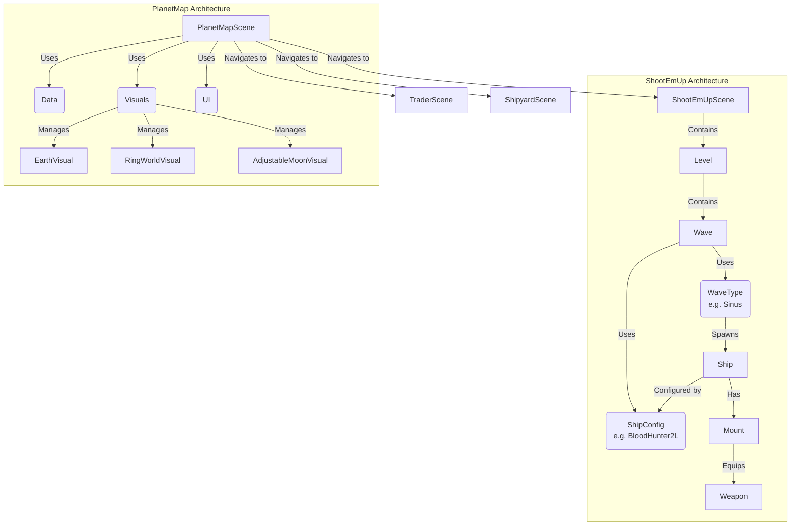

# Laser Phaser <a href="https://pkcpkc.github.io/laser-phaser/"></a>


## Credits
Concept and design by **Leopold** and **Thaddeus**.  
Implemented with the help of [**Google Antigravity**](https://antigravity.google/), [**Phaser.io**](https://phaser.io/) and... **Paul** ;)

## Homage
This game is a homage to the legendary late 80s shooter games that defined the genre. We draw inspiration from the classics:

*   **R-Type**
*   **Xenon II Megablast**
*   **Blood Money**
*   **Katakis**

### Gallery

| Game | Cover | Gameplay |
| :--- | :---: | :---: |
| [**R-Type**](https://en.wikipedia.org/wiki/R-Type) |  |  |
| [**Xenon II Megablast**](https://en.wikipedia.org/wiki/Xenon_2:_Megablast) |  |  |
| [**Blood Money**](https://en.wikipedia.org/wiki/Blood_Money_(video_game)) |  |  |
| [**Katakis**](https://en.wikipedia.org/wiki/Katakis) |  |  |

## Markers Setup

Markers are special pixels defined directly in the ship's source image (`res/ships/*.png`) to define attachment points for components. They are stripped during atlas generation but used to generate metadata.

### Marker Types

| Type | Color (Hex) | RGB | Description |
| :--- | :--- | :--- | :--- |
| **Thruster** | `#FFA500` | `255, 165, 0` | Positioning for engine trails. |
| **Laser** | `#00FF00` | `0, 255, 0` | Attachment point for laser cannons. |
| **Rocket** | `#FFFFFF` | `255, 255, 255` | Attachment point for rocket launchers. |
| **Armor** | `#000000` | `0, 0, 0` | (Future Use) Armor plate attachment. |

### Setting Orientation

To define the rotation (angle) of a marker (e.g., a side-firing cannon), place a **Red Pixel** (`#FF0000` / `255, 0, 0`) adjacent to the marker pixel within a 3x3 grid.

*   The generator looks at the 8 neighbors of the marker pixel.
*   If a red pixel is found, the angle is calculated from the vector `(Marker -> Red Pixel)`.
*   **Example**: Placing a red pixel directly to the **right** of a Green (Laser) pixel will set that laser's angle to 0° (firing right). Placing it **below** sets it to 90° (firing down).

## Technical Overview

**Laser Phaser** is a modern web-based shoot 'em up built with robust technologies to ensure high performance and a smooth development experience.

*   **Engine**: [Phaser 3](https://phaser.io/) - A fast, free, and fun open-source HTML5 game framework.
*   **Language**: [TypeScript](https://www.typescriptlang.org/) - For type-safe, maintainable code.
*   **Build Tool**: [Vite](https://vitejs.dev/) - Next Generation Frontend Tooling for lightning-fast development servers and optimized builds.
*   **Testing**: [Vitest](https://vitest.dev/) - Blazing fast unit test framework. (Current Coverage: 100% of source files)

## Asset Pipeline

We use a custom asset pipeline to optimize game performance and development workflow:

*   **Texture Atlases**: Automatically generated from `public/assets` folders using `free-tex-packer-core`. Run `npm run build:atlases` to regenerate.
*   **Marker Generation**: Ship attachment points (markers) are defined in JSON/Typescript and validated. Run `npm run build:markers` to update.

### Game Entities & Architecture



### Directory Structure

The project follows a domain-driven structure for scenes and content:

*   `src/scenes/`: Scene logic (Planet Map, Base Scene, etc.)
    *   `planet-map/`: Visuals and logic for the navigation map.
    *   `shoot-em-ups/`: Active gameplay levels.
    *   `traders/` & `shipyards/`: Meta-game interfaces.
*   `src/ships/`: Ship definitions, configurations, and component logic.
*   `src/logic/`: Core game managers (Collision, Game State, Player Control).
*   `src/levels/` & `src/waves/`: Level definitions and wave spawning logic.

### Getting Started

To fire up the engines and start developing:

1.  **Install dependencies:**
    ```bash
    npm install
    ```

2.  **Generate Assets (Atlases & Markers):**
    ```bash
    npm run build:atlases
    npm run build:markers
    ```

3.  **Start the development server:**
    ```bash
    npm run dev
    ```

4.  **Build for production:**
    ```bash
    npm run build
    ```

5.  **Run tests:**
    ```bash
    npm test
    ```
