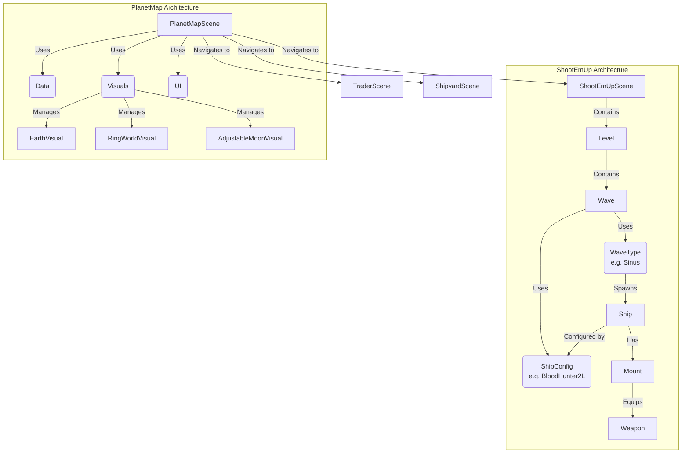

# Laser Phaser <a href="https://pkcpkc.github.io/laser-phaser/"></a>


## Credits
Concept and design by **Leopold** and **Thaddeus**.  
Implemented with the help of [**Google Antigravity**](https://antigravity.google/), [**Phaser.io**](https://phaser.io/) and... **Paul** ;)

## Homage
This game is a homage to the legendary late 80s shooter games that defined the genre. We draw inspiration from the classics:

*   **R-Type**
*   **Xenon II Megablast**
*   **Blood Money**
*   **Katakis**

### Gallery

| Game | Cover | Gameplay |
| :--- | :---: | :---: |
| [**R-Type**](https://en.wikipedia.org/wiki/R-Type) |  |  |
| [**Xenon II Megablast**](https://en.wikipedia.org/wiki/Xenon_2:_Megablast) |  |  |
| [**Blood Money**](https://en.wikipedia.org/wiki/Blood_Money_(video_game)) |  |  |
| [**Katakis**](https://en.wikipedia.org/wiki/Katakis) |  |  |

## Technical Overview

**Laser Phaser** is a modern web-based shoot 'em up built with robust technologies to ensure high performance and a smooth development experience.

*   **Engine**: [Phaser 3](https://phaser.io/) - A fast, free, and fun open-source HTML5 game framework.
*   **Language**: [TypeScript](https://www.typescriptlang.org/) - For type-safe, maintainable code.
*   **Build Tool**: [Vite](https://vitejs.dev/) - Next Generation Frontend Tooling for lightning-fast development servers and optimized builds.
*   **Testing**: [Vitest](https://vitest.dev/) - Blazing fast unit test framework.

### Game Entities & Architecture



### Directory Structure

The project follows a domain-driven structure for scenes:

*   `src/scenes/planet-map-scene.ts`: The main hub.
*   `src/scenes/shoot-em-ups/`: Contains active gameplay levels (e.g., `blood-hunters.ts`).
*   `src/scenes/traders/`: Trading interfaces.
*   `src/scenes/shipyards/`: Upgrade interfaces.
*   `src/scenes/tower-defenses/`: Future tower defense modes.

### Getting Started

To fire up the engines and start developing:

1.  **Install dependencies:**
    ```bash
    npm install
    ```

2.  **Start the development server:**
    ```bash
    npm run dev
    ```

3.  **Build for production:**
    ```bash
    npm run build
    ```

4.  **Run tests:**
    ```bash
    npm test
    ```
