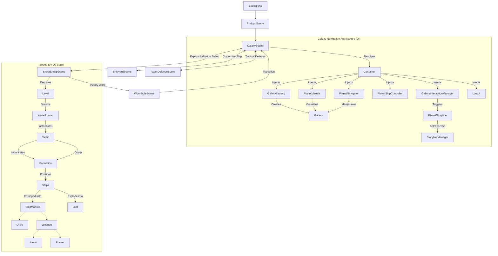
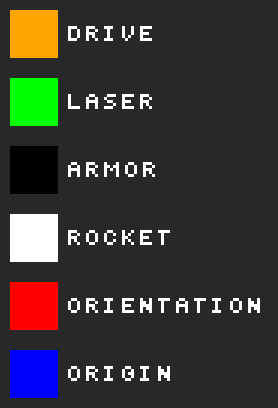

# Laser Phaser - Technical Documentation

This document provides technical details for developers working on **Laser Phaser**.

> Everything in the universe—from galaxies and star systems to planet visuals and effects—is **procedurally created**. The only exceptions are the **ships**, which are hand-drawn by the kids (Leopold & Thaddeus) and then "pimped" for the digital realm by [**Nano Banana**](https://gemini.google/overview/image-generation/).

## Tech Stack

**Laser Phaser** is a modern web-based shoot 'em up built with robust technologies to ensure high performance and a smooth development experience.

### Core Technologies
*   **Engine**: [Phaser 3](https://phaser.io/) - A fast, free, and fun open-source HTML5 game framework.
    *   **Physics**: Uses the integrated **Matter.js** engine for complex collision detection and body simulations.
*   **Language**: [TypeScript](https://www.typescriptlang.org/) - For type-safe, maintainable code.
*   **Build Tool**: [Vite](https://vitejs.dev/) - Next Generation Frontend Tooling for lightning-fast development servers and optimized builds.
*   **Dependency Injection**: [InversifyJS](https://inversify.io/) - A powerful and lightweight inversion of control container for JavaScript & Node.js apps.
    *   **Reflection**: `reflect-metadata` - Used for decorator metadata support.

## Architecture

The game follows a modular, domain-driven architecture utilizing Dependency Injection (DI) to manage complexity. The flow starts with asset preloading and transitions through a centralized map-based navigation system to various gameplay modes.

## Diagram



## Key Components

*   **Dependency Injection**: The core architecture relies on a DI container (`di/container.ts`) to manage dependencies. Scenes bind themselves to the container, and components (like `PlanetNavigator`, `PlayerShipController`) are injected, promoting loose coupling and easier testing.
*   **Galaxy System**: A modular configuration-driven map. Each galaxy (e.g., *Blood Hunters*) defines its own physics, backgrounds, and planet layouts. The `GalaxyScene` has been decomposed into specialized managers (`PlanetVisuals`, `PlanetNavigator`, etc.) to avoid "God Class" issues.
*   **Wormhole Transition**: A cinematic transition scene used when jumping between galaxies, ensuring a smooth visual bridge.
*   **Storyline & Intros**: Managed by `StorylineManager`. Markdown storylines are **compiled to TypeScript** (`src-generated/storylines/storylines.ts`) during build, eliminating runtime parsing overhead.
*   **Module System**: Ships are dynamically built using category-based modules (Drives, Lasers, Rockets), allowing for deep customization in the Shipyard.
*   **Tactic & Formation System**: Decouples enemy movement logic (`Tactics`) from spawn patterns (`Formations`). `WaveRunner` manages the lifecycle of a `Tactic`.

### Dependency Injection

The game uses **InversifyJS** to manage dependencies between scenes, logic managers, and UI components. This promotes loose coupling and makes unit testing easier by allowing dependencies to be mocked.

#### Implicit Binding
We utilize `autoBindInjectable: true` in our DI container. This means you **do not** need to manually bind classes in the container. As long as a class is decorated with `@injectable()`, implicit binding will automatically resolve it when requested.

```typescript
// No manual binding required!
@injectable()
export class LaserService { ... }

// In another class:
constructor(private laserService: LaserService) { ... }
```

#### Custom Decorators
We use custom decorators to handle specific scopes and lifecycle management.

*   **`@SceneScoped()`**:
    *  Marks a service as "scoped" to the current Phaser Scene. This ensures that the service is re-instantiated whenever a new scene is started, preventing stale state from previous levels.
*   **`@InjectScene()`**
    *  Injects the current active Phaser Scene (maps to `'Scene'`).
*   **`@InjectPlayerCursorKeys()`**
    *  Injects the input cursor keys (maps to `'PlayerCursorKeys'`).

### Storyline Management

Planet intro texts are managed in `res/storylines/storylines.md`. Grouped by galaxy and planet ID.
The build process (`npm run build:storylines`) compiles these files into `src-generated/storylines/storylines.ts` for type-safe, synchronous access.

**Format:**
```markdown
## [galaxy-id]
### [planet-id]
Text content...
```

### Markers Setup

Markers are special pixels defined directly in the ship's source image (`res/ships/*.png`) to define attachment points.

| Type | Color (Hex) | RGB | Description |
| :--- | :--- | :--- | :--- |
| **Thruster** | `#FFA500` | `255, 165, 0` | Positioning for engine trails. |
| **Laser** | `#00FF00` | `0, 255, 0` | Attachment point for laser cannons. |
| **Rocket** | `#FFFFFF` | `255, 255, 255` | Attachment point for rocket launchers. |
| **Origin** | `#0000FF` | `0, 0, 255` | Center point definition/Pivot. |

#### Setting Orientation

To define the rotation (angle) of a marker, place a **Red Pixel** (`#FF0000`) adjacent to the marker pixel. The generator calculates the angle from the vector `(Marker -> Red Pixel)`.

#### Color Palette Analysis



## Asset Pipeline & Tooling

We use a custom asset pipeline and various tools to optimize game performance and help with asset creation:

*   **[Nano Banana](https://gemini.google/overview/image-generation/)**: The creative engine behind pimping hand-drawn ship assets for the digital realm.
*   **Meta SAM 3**: [Segment Anything Model](https://aidemos.meta.com/segment-anything/gallery) - Used for high-precision image segmentation.
*   **Texture Atlases**: Automatically generated from `public/assets` folders using `free-tex-packer-core`.
*   **Marker Generation**: Ship attachment points (markers) are extracted from ship PNGs to define where thrusters, lasers, and rockets attached.
*   **Custom Build Scripts**: Written in TypeScript/JavaScript, executed via `tsx` or `node`:
    *   `scripts/generate-markers.ts`: Extracts marker data from ship PNGs.
    *   `scripts/generate-atlases.js`: Orchestrates texture packing.
    *   `scripts/generate-color-palette.ts`: Analyzes assets for UI color matching.
    *   `scripts/build-storylines.ts`: Compiles Markdown storylines to TypeScript.
*   **Image Processing**: Uses `pngjs` for low-level pixel analysis during marker and palette generation.

### Generated Code
*   `src-generated/`: Contains auto-generated source files (e.g., compiled storylines, marker data). These should not be edited manually.

## Testing Stack

We maintain a high standard of code quality through a comprehensive testing suite.

### Testing Frameworks
*   **Unit Testing**: [Vitest](https://vitest.dev/) - Blazing fast unit test framework. Used for core logic, managers, and utility functions.
    *   **Environment**: Uses `jsdom` to simulate a browser environment for DOM-related tests.
*   **End-to-End (E2E) Testing**: [Playwright](https://playwright.dev/) - Reliable testing for modern web apps. Used to verify game interactions and scene transitions across different browsers.

### Test Integrity & Automation
*   **Test Check Script**: `scripts/check-tests.ts` - Ensures that every source file in `src/` has a corresponding test file in `tests/`, maintaining 100% file coverage.
*   **Linter**: `tsc --noEmit` - Used for static type checking across the entire codebase.
*   **Timer Safety**: `src/utils/time-utils.ts` - A wrapper class (`TimeUtils`) that manages `delayedCall` and `setTimeout`. It automatically switches to `setTimeout` in E2E environments (`TEST_E2E=true`) to prevent timeouts caused by browser background throttling, while maintaining safe scene access checks. Always use `TimeUtils.delayedCall` instead of `scene.time.delayedCall` for game logic.

### HTTP Debugging Parameters

You can append these parameters to the URL (e.g., `http://localhost:5173/?galaxyId=blood-hunters-galaxy`) to jump directly to specific states or enable debug features.

| Parameter | Value | Description |
| :--- | :--- | :--- |
| `galaxyId` | `[string]` | Skips the wormhole and starts directly in the specified galaxy (e.g., `blood-hunters-galaxy`). |
| `autoLaunchPlanetId` | `[string]` | Requires `galaxyId`. Starts directly at the specified planet and **launches the level automatically**. |
| `godMode` | `true` | Disables collision detection for the player ship (except Loot). |
| `locale` | `en`, `de`, `fr`, etc. | Forces the game to load in the specified locale. |

## Getting Started

To fire up the engines and start developing, use the following commands:

### NPM Scripts

#### Development Commands
*   `npm install`: Install project dependencies.
*   `npm run dev`: Start the development server at `http://localhost:5173`.
*   `npm run debug`: Start in debug mode (shows physics bodies, enables 'B' key state dump, sets `import.meta.env.MODE='debug'`).
*   `npm run preview`: Preview the production build locally.

#### Build & Asset Commands
*   `npm run build`: Full production build (generates atlases, markers, and bundles the app).
*   `npm run build:atlases`: Manually regenerate texture atlases from `public/assets`.
*   `npm run build:markers`: Manually extract marker data from ship PNGs.
*   `npm run build:storylines`: Convert markdown storylines in `res/storylines/` to TypeScript in `src-generated/`.
*   `npm run build:colors`: Analyze assets for UI color matching.

#### Testing & Quality Commands
*   `npm test`: Run all unit tests with Vitest.
*   `npm run test:watch`: Run unit tests in watch mode.
*   `npm run test:check`: Verify that every source file has a corresponding test file.
*   `npm run test:e2e`: Run end-to-end tests with Playwright.
*   `npm run test:e2e-ui`: Run E2E tests with the Playwright UI.
*   `npm run lint`: Static type checking with TypeScript (`tsc --noEmit`).

### Antigravity Workflows

We use **Antigravity** workflows to automate complex agentic tasks. These are defined in `.agent/workflows/`.

*   **/translate_storylines**: Automates the translation of the default English storyline (`storylines.md`) into all supported locales found in `res/storylines/`. Preserves markdown structure and proper nouns.
*   **/add_ship**: Automates the process of adding a new ship from an existing PNG asset. Generates markers, updates atlases, and creates the TypeScript definition and configuration files. Requires the ship name as a parameter (e.g., "firefly").

---

*Keep flying, keep shooting, and may the Force be with your phasers!*
